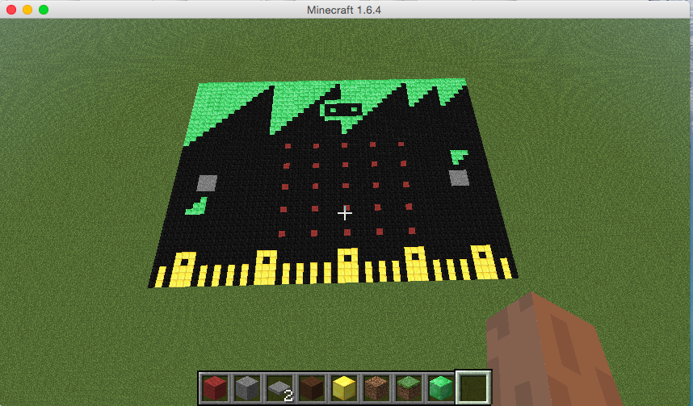

Minecraft micro:bit
====

This is a simulation of a micro:bit, inside Minecraft.

It is work in progress, and an early version only.


Usage
====

```
python
import mc_microbit as m
m.build()
m.microbit.display.scroll("Hello everyone")
```



The micro:bit design was done with help from Jamie from the Harlow Raspberry Pi club.

David Whale
@whaleygeek
